# Day 23 — IaC: Parameterised Bicep Modules

**What this piece adds:** Every Azure resource the Bus Booking app needs — SQL Server, Service Bus, App Service — described as composable, parameterised Bicep modules. No portal click-ops required; a single `az deployment group create` stands up a complete environment in under 3 minutes.

---

## Proof It Runs

### App — startup & seeding
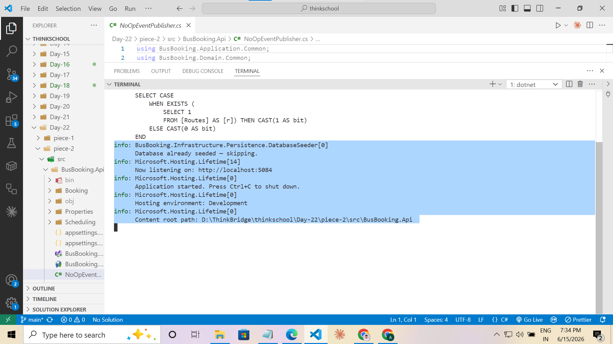

### App — search schedules
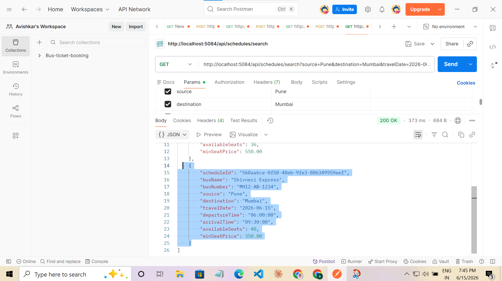

### App — seat availability
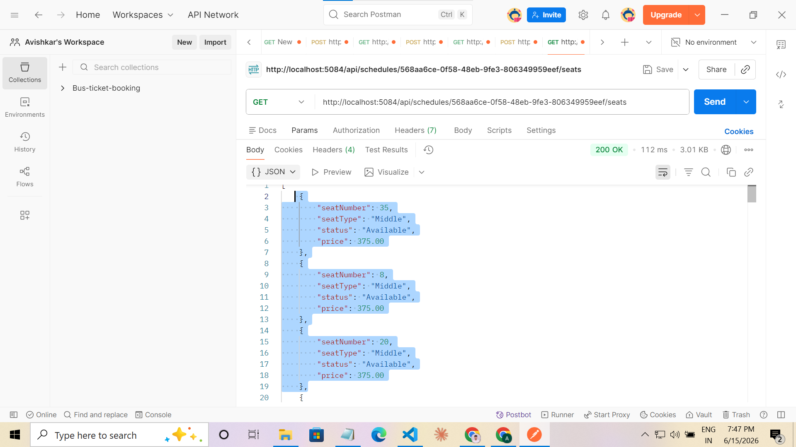

### App — create booking (201 Created)
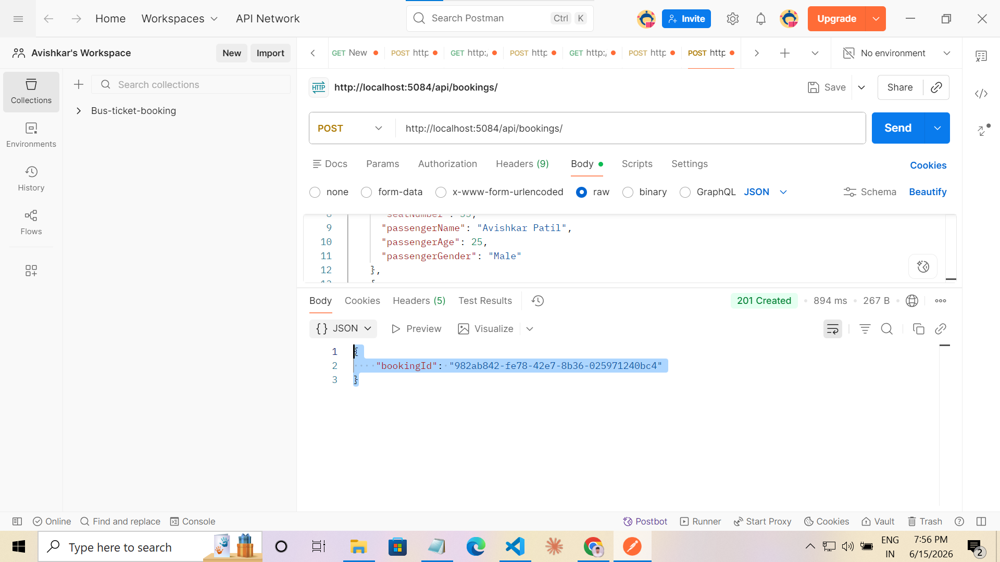

### App — user booking history
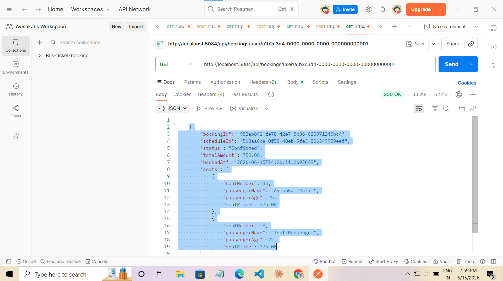

### App — cancel booking (204 No Content)
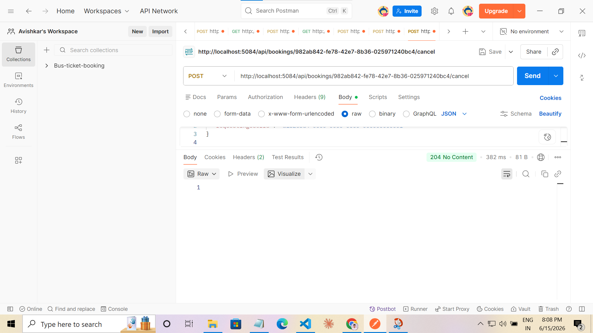

### App — all tests passing
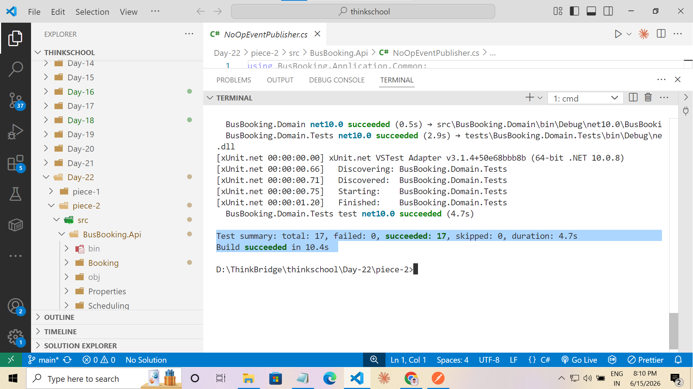

### IaC — Bicep build (0 errors, 0 warnings)
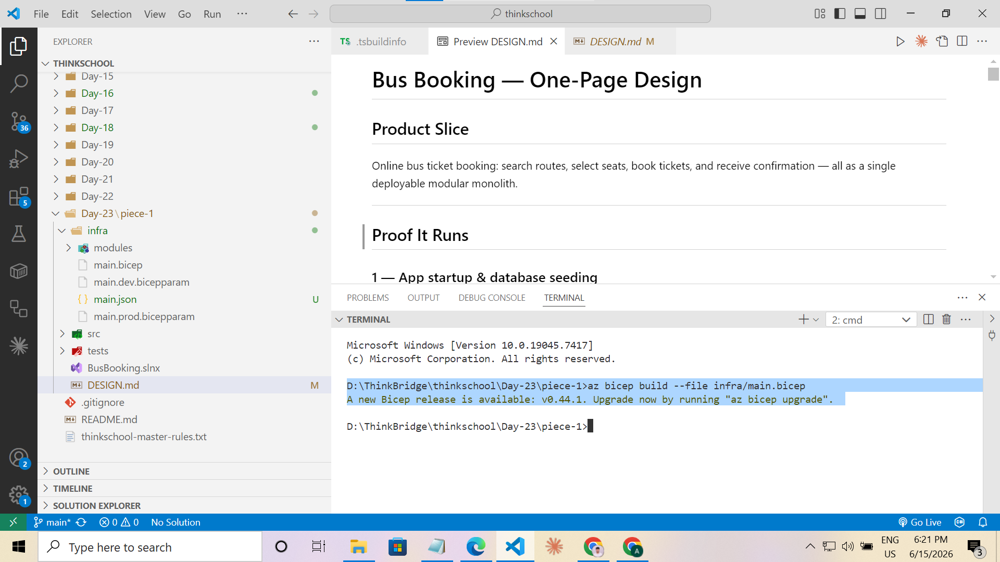

### IaC — what-if dry run (12 resources to create)
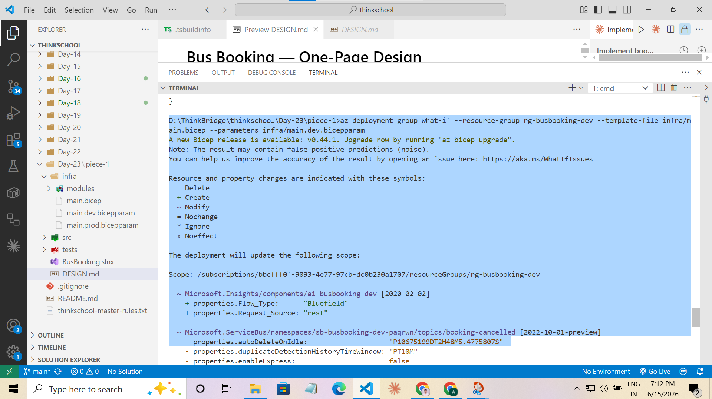

### IaC — deployment succeeded
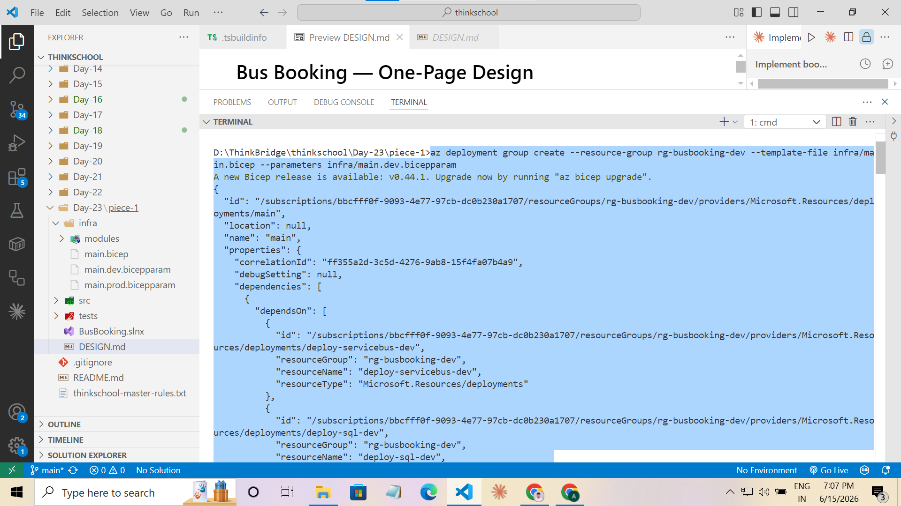

### IaC — deployment outputs (API URL, SQL FQDN, DB name)
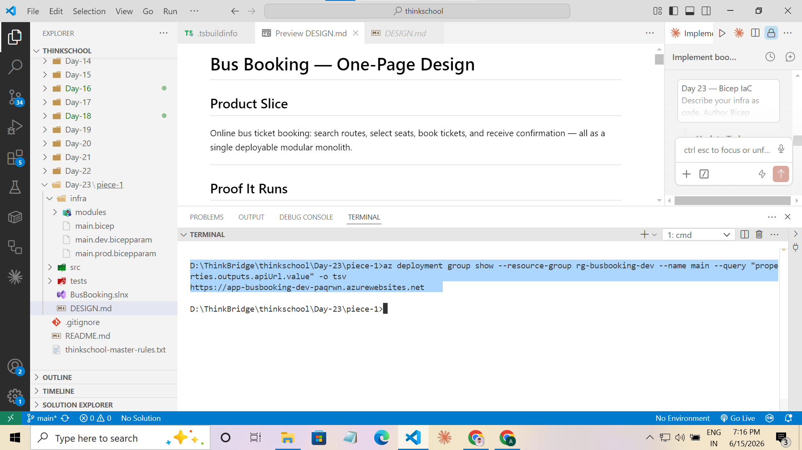

### IaC — all 12 resources visible in Azure
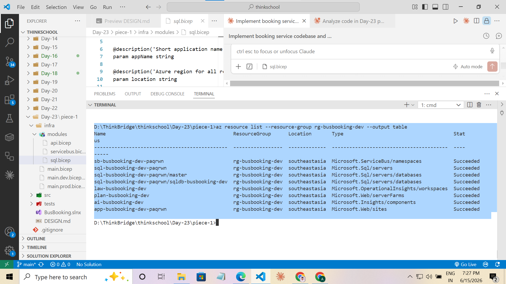

### IaC — resource group cleanup
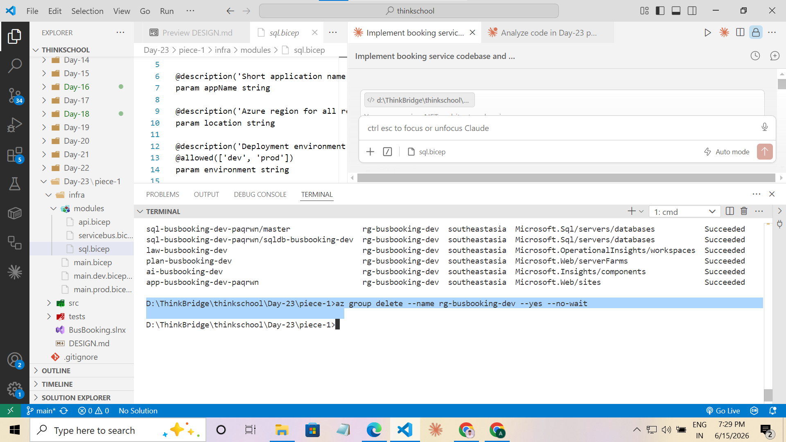

---

## What Was Built

The Bicep IaC layer that provisions every Azure resource the bus booking modular monolith needs:

```
infra/
├── main.bicep                ← orchestrator; composes the three modules below
├── main.dev.bicepparam       ← dev parameter file  (Basic SQL, B1 App Service)
├── main.prod.bicepparam      ← prod parameter file (S2 SQL, P1v3 App Service)
└── modules/
    ├── sql.bicep             ← SQL Server + Database + firewall rules
    ├── servicebus.bicep      ← Namespace + booking-confirmed/cancelled topics + auth rule
    └── api.bicep             ← Log Analytics + App Insights + App Service Plan + Web App
```

---

## Module Design

### `sql.bicep`
Provisions a SQL Server and database, with environment-aware firewall rules.

- Dev: `AllowDevAccess` firewall rule opens 0.0.0.0–255.255.255.255 so developers can reach the DB from local machines.
- Prod: only `AllowAzureServices` is open — the App Service connects via Azure's internal network; no public IP range is whitelisted.
- Backup: Local-redundant in dev, Geo-redundant in prod.
- Outputs `serverFqdn`, `databaseName`, and `connectionString` (consumed by `api.bicep`).

### `servicebus.bicep`
Provisions a Service Bus namespace with two topics and a single shared auth rule.

- Topics: `booking-confirmed`, `booking-cancelled` — map 1:1 to domain events raised by the Booking aggregate.
- Auth rule: `api-send-listen` — Send + Listen rights only. No Manage permission issued to the app.
- Outputs `connectionString` (consumed by `api.bicep`).

### `api.bicep`
Provisions the full observability + compute stack.

- Log Analytics workspace → App Insights component wired to it.
- Linux App Service Plan (SKU is a parameter: B1 in dev, P1v3 in prod).
- Web App: .NET 10, HTTPS-only, `APPLICATIONINSIGHTS_CONNECTION_STRING` and both connection strings injected as app settings at deploy time — no secrets in source control.
- Zone-redundancy enabled in prod (P1v3 required).

### `main.bicep` — orchestrator
Composes the three modules and threads outputs between them:

```
sql.outputs.connectionString       ─┐
                                    ├─► api module params
serviceBus.outputs.connectionString ─┘
```

Exposes four outputs: `apiUrl`, `apiHostName`, `sqlServerFqdn`, `sqlDatabaseName`.

---

## Resource Map

```
Resource Group: rg-busbooking-{env}
│
├── sql-busbooking-{env}-{suffix}          Microsoft.Sql/servers
│   ├── sqldb-busbooking-{env}             Microsoft.Sql/servers/databases
│   └── firewallRules                      AllowAzureServices + AllowDevAccess (dev only)
│
├── sb-busbooking-{env}-{suffix}           Microsoft.ServiceBus/namespaces  (Standard)
│   ├── topics/booking-confirmed           Microsoft.ServiceBus/namespaces/topics
│   ├── topics/booking-cancelled           Microsoft.ServiceBus/namespaces/topics
│   └── authorizationRules/api-send-listen Send + Listen only (least privilege)
│
├── law-busbooking-{env}                   Microsoft.OperationalInsights/workspaces
├── ai-busbooking-{env}                    Microsoft.Insights/components
├── plan-busbooking-{env}                  Microsoft.Web/serverfarms (Linux)
└── app-busbooking-{env}-{suffix}          Microsoft.Web/sites (.NET 10, HTTPS-only)
```

`{suffix}` = `take(uniqueString(resourceGroup().id), 6)` — deterministic per resource group, prevents global DNS name collisions across Azure tenants.

---

## SKU Comparison: Dev vs Prod

| Resource | Dev | Prod | Why |
|---|---|---|---|
| SQL Database | Basic / 5 DTU | S2 / 50 DTU | Dev: cheapest paid tier; Prod: handles burst load |
| SQL backup | Local-redundant | Geo-redundant | Cost vs data recovery guarantee |
| App Service Plan | B1 (1 vCPU, 1.75 GB) | P1v3 (2 vCPU, 8 GB) | P-series unlocks zone redundancy |
| Zone-redundant App Service | No | Yes | HA in prod; unnecessary and unbillable on B-series |
| Service Bus tier | Standard | Standard | Topics require ≥ Standard in both envs |
| Log Analytics retention | 30 days | 90 days | Prod needs longer audit trail |
| Dev SQL firewall | 0.0.0.0–255.255.255.255 | AllowAzureServices only | Devs need local DB access; prod locks down |

---

## Secrets Handling

The SQL admin password is **never committed**. Both `.bicepparam` files read it from an environment variable at deploy time:

```bicep
// main.dev.bicepparam
param sqlAdminPassword = readEnvironmentVariable('SQL_ADMIN_PASSWORD')
```

**Local deploy:**
```powershell
$env:SQL_ADMIN_PASSWORD = 'YourP@ssword123!'
```

**GitHub Actions:**
```yaml
env:
  SQL_ADMIN_PASSWORD: ${{ secrets.SQL_ADMIN_PASSWORD }}
```

App settings (connection strings, App Insights key) are injected directly into the Web App by `api.bicep` at deploy time — never stored in `appsettings.json`.

---

## Deploy Runbook

```powershell
# 1. Set the SQL password for this shell session
$env:SQL_ADMIN_PASSWORD = 'YourP@ssword123!'

# 2. Create resource group (once per environment)
az group create --name rg-busbooking-dev --location southeastasia

# 3. Dry-run — shows every resource that will be created or modified
az deployment group what-if `
  --resource-group rg-busbooking-dev `
  --template-file infra/main.bicep `
  --parameters infra/main.dev.bicepparam

# 4. Deploy
az deployment group create `
  --resource-group rg-busbooking-dev `
  --template-file infra/main.bicep `
  --parameters infra/main.dev.bicepparam

# 5. Retrieve outputs
az deployment group show `
  --resource-group rg-busbooking-dev `
  --name main `
  --query properties.outputs -o json

# 6. Apply EF Core migrations against the provisioned database
$fqdn = az deployment group show `
  --resource-group rg-busbooking-dev `
  --name main `
  --query "properties.outputs.sqlServerFqdn.value" -o tsv

dotnet ef database update `
  --project src/BusBooking.Infrastructure `
  --startup-project src/BusBooking.Api `
  --connection "Server=tcp:$fqdn,1433;Initial Catalog=sqldb-busbooking-dev;User Id=sqladmin;Password=$env:SQL_ADMIN_PASSWORD;Encrypt=True;"

# 7. Cleanup (tears down all 12 resources at once)
az group delete --name rg-busbooking-dev --yes --no-wait
```

---

## Key Design Decisions

| Decision | Choice | Reason |
|---|---|---|
| IaC tool | Bicep | Native ARM DSL; no Terraform state file to manage; first-class `az` integration |
| Module granularity | sql / servicebus / api | Each module owns one bounded concern; independently reusable |
| Naming suffix | `uniqueString(resourceGroup().id)` | Deterministic + collision-proof across tenants without a random seed |
| Secrets at deploy time | `readEnvironmentVariable()` in `.bicepparam` | Password never touches source control; works identically locally and in CI |
| App settings injection | `api.bicep` writes connection strings as Web App settings | App reads from environment — no `appsettings.Production.json` needed |
| Region | `southeastasia` | Only Azure for Students region with Container Apps quota (constraint from Day prior) |
| Dev firewall | Wide-open IP range | Devs need local SQL access; acceptable risk in ephemeral dev resource group |
| Prod firewall | AllowAzureServices only | App Service accesses SQL within Azure's network; no public endpoint needed |
