# Online Bus Ticket Booking System

## Project Overview

.NET 10 Clean Architecture API deployed to Azure via the Azure Developer CLI (`azd`) with Azure Deployment Stacks managing both `dev` and `prod` environments, and Managed Identity for all Azure resource access.

## Architecture

Four-layer Clean Architecture deployed as a Linux App Service on Azure:

| Layer | Responsibility |
|---|---|
| Domain | Entities, value objects, domain rules |
| Application | CQRS handlers, repository interfaces, event contracts |
| Infrastructure | EF Core, Service Bus, repositories, background services |
| Api | Minimal API endpoints, DI wiring, auth middleware |

## Contents

- [Day 24 — azd + Azure Deployment Stacks](#day-24--azd--azure-deployment-stacks)
- [Day 25 — Identity End-to-End](#day-25--identity-end-to-end)
- [Day 26 — App Insights + KQL](#day-26--app-insights--kql)

---

## Day 24 — azd + Azure Deployment Stacks

**Online Bus Ticket Booking System** — .NET 10 Clean Architecture API deployed to Azure via the Azure Developer CLI (`azd`) with Azure Deployment Stacks managing both `dev` and `prod` environments.

---

## What Deployment Stacks give you over plain deployments

A plain `az deployment group create` is fire-and-forget — ARM deploys resources and has no memory of them. An **Azure Deployment Stack** owns every resource it created:

- **Orphan prevention** — drop a resource from the Bicep template and the stack *deletes* it on the next run; no forgotten resources accumulate.
- **Drift detection & prevention** — the stack attaches `denyWriteAndDelete` deny assignments to every managed resource, so any out-of-band manual write or delete fails immediately with `DenyAssignmentAuthorizationFailed` rather than silently drifting.
- **Atomic teardown** — `azd down` or `az stack group delete --action-on-unmanage deleteAll` removes every stack-managed resource in one operation.

---

## Project structure

```
.
├── azure.yaml                          # azd project config — Deployment Stacks entry point
├── infra/
│   ├── main.bicep                      # orchestrator (env-driven SKU derivation)
│   ├── main.parameters.json            # azd token-substitution bridge
│   ├── main.dev.bicepparam             # dev params (Basic SQL, B1 App Service)
│   ├── main.prod.bicepparam            # prod params (S2 SQL, B2 App Service)
│   └── modules/
│       ├── sql.bicep
│       ├── servicebus.bicep
│       └── api.bicep
└── src/
    ├── BusBooking.Api/
    ├── BusBooking.Application/
    ├── BusBooking.Domain/
    └── BusBooking.Infrastructure/
```

---

## azd configuration — `azure.yaml`

```yaml
name: bus-booking

services:
  api:
    project: ./src/BusBooking.Api
    language: dotnet
    host: appservice

infra:
  provider: bicep
  path: ./infra
  module: main

  # Azure Deployment Stacks (requires: azd config set alpha.deployment.stacks on)
  deploymentStacks:
    actionOnUnmanage:
      resources: delete          # resources dropped from template are DELETED
      resourceGroups: delete
      managementGroups: detach
    denySettings:
      mode: denyWriteAndDelete   # blocks manual writes/deletes → drift prevention
      applyToChildScopes: true   # deny assignments cascade to child resources
      excludedPrincipals:
        - bed97e4c-dfbd-4aa1-a1e4-ec7af963a676  # deploying user exempted for azd publish
```

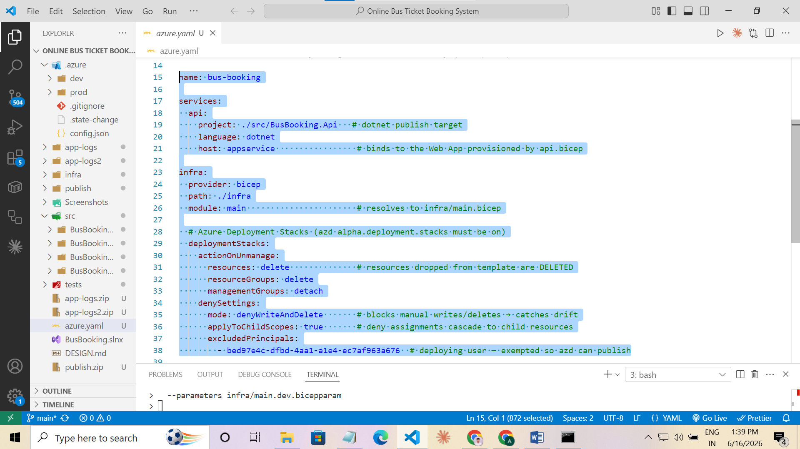

---

## Environment-driven SKU derivation (`infra/main.bicep`)

SKU choices are resolved inside `main.bicep` from the `environment` parameter — no SKU parameters exposed to callers:

```bicep
var sqlSkuName        = environment == 'prod' ? 'S2'    : 'Basic'
var sqlCapacity       = environment == 'prod' ? 50      : 5
var serviceBusSku     = 'Standard'
var appServicePlanSku = environment == 'prod' ? 'B2'    : 'B1'
```

| SKU | dev | prod |
|-----|-----|------|
| Azure SQL | Basic (5 DTU, 2 GB) | S2 (50 DTU, 100 GB) |
| App Service | B1 (1 vCPU, 1.75 GB) | B2 (2 vCPU, 3.5 GB) |
| Service Bus | Standard | Standard |

---

## Deploy commands

### Prerequisites

```powershell
# Enable Deployment Stacks alpha feature (one-time per machine)
azd config set alpha.deployment.stacks on

azd auth login
```

### Dev environment

```powershell
azd env new dev
azd env set AZURE_SUBSCRIPTION_ID <id>   --environment dev
azd env set AZURE_RESOURCE_GROUP   rg-busbooking-dev --environment dev
azd env set AZURE_LOCATION         southeastasia      --environment dev
# Write SQL_ADMIN_PASSWORD to .azure/dev/.env (never in CLI args)

azd up --environment dev
```

### Prod environment

```powershell
az group create --name rg-busbooking-prod --location southeastasia

azd env new prod
azd env set AZURE_SUBSCRIPTION_ID <id>            --environment prod
azd env set AZURE_RESOURCE_GROUP   rg-busbooking-prod --environment prod
azd env set AZURE_LOCATION         southeastasia      --environment prod
# Write SQL_ADMIN_PASSWORD to .azure/prod/.env

azd provision --environment prod
dotnet ef database update --project src/BusBooking.Infrastructure \
                           --startup-project src/BusBooking.Api
azd deploy --environment prod
```

---

## azd environments registered

```
NAME    DEFAULT   LOCAL
dev     true      true
prod    false     true
```

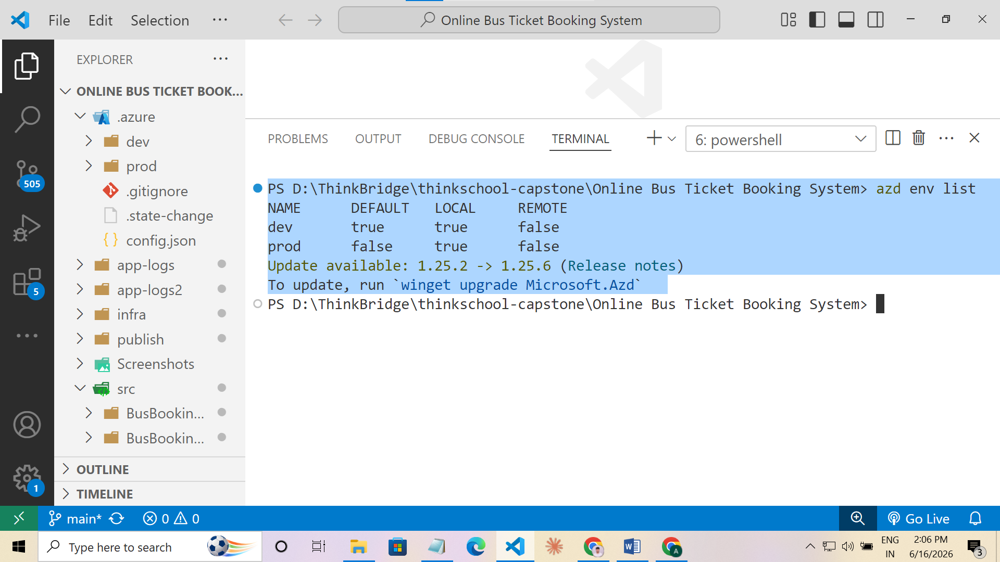

---

## Deploy output — both environments live

```
DEV  GET /api/schedules/search  →  200 OK
PROD GET /api/schedules/search  →  200 OK

Stack          State      Deny                Resources
azd-stack-dev  succeeded  denyWriteAndDelete  12
azd-stack-prod succeeded  denyWriteAndDelete  11
```

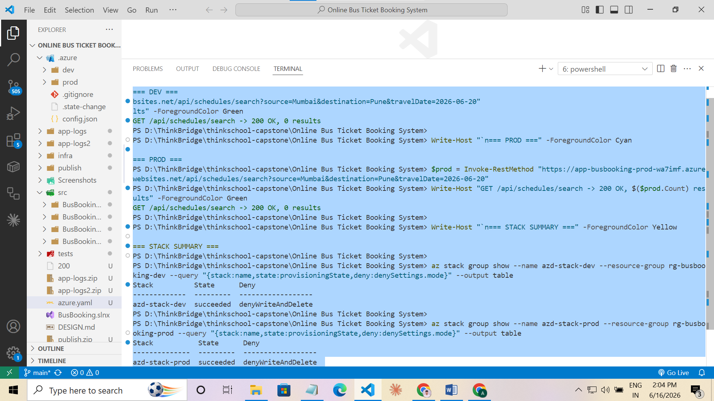

---

## Azure resource groups

Both resource groups provisioned in Southeast Asia:

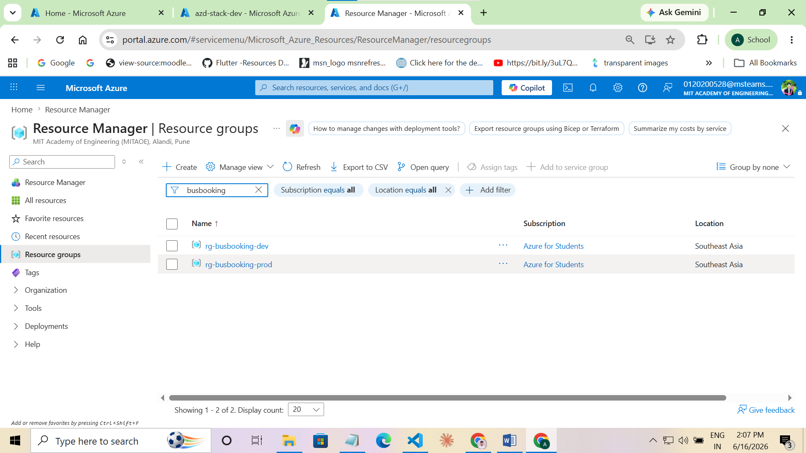

---

## Dev Deployment Stack — Portal

Stack `azd-stack-dev` tracking 12 managed resources under `rg-busbooking-dev`:

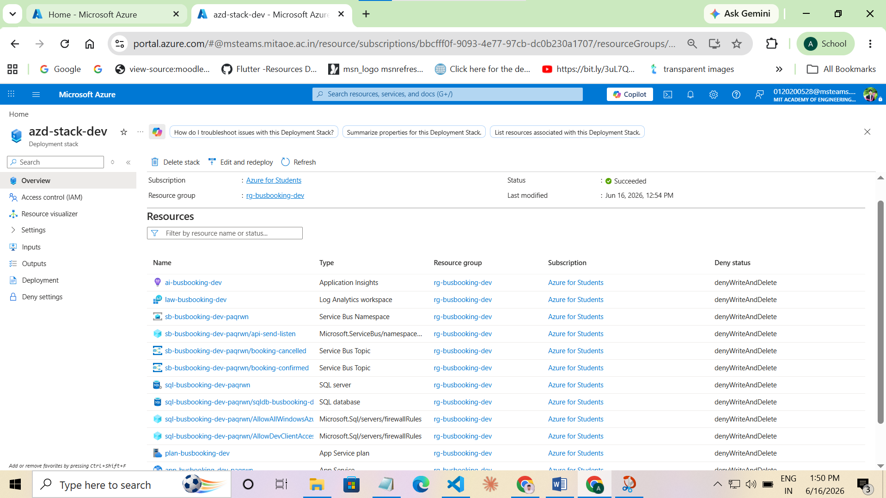

---

## Prod Deployment Stack — Portal

Stack `azd-stack-prod` tracking 11 managed resources under `rg-busbooking-prod`:

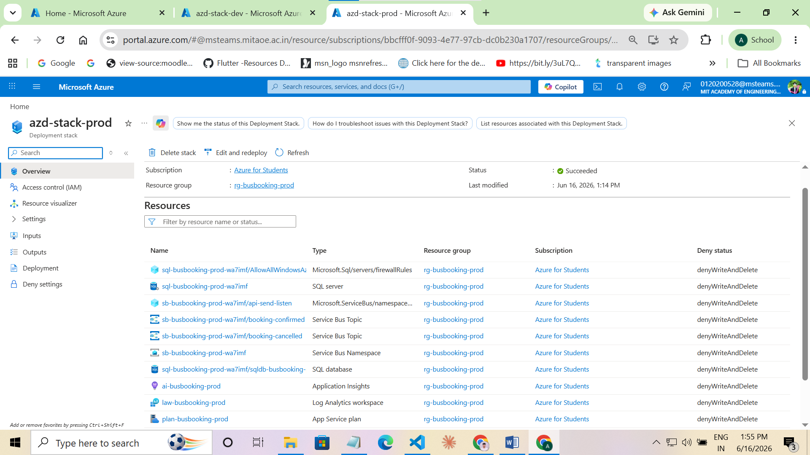

---

## Deny assignments — drift protection active

The stack attaches `denyWriteAndDelete` deny assignments to every managed resource. Any manual change attempted outside of a stack deployment is blocked:

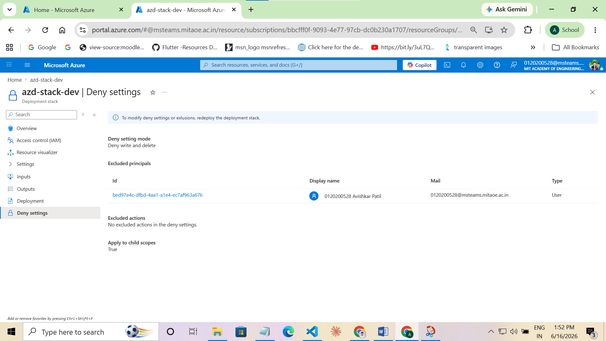

---

## Live API endpoints

Both environments expose the same Minimal API surface:

| Method | Path | Description |
|--------|------|-------------|
| `GET` | `/api/schedules/search?source=X&destination=Y&travelDate=YYYY-MM-DD` | Search available schedules |
| `GET` | `/api/schedules/{scheduleId}/seats` | List seats for a schedule |
| `POST` | `/api/bookings` | Create a booking |
| `GET` | `/api/bookings/user/{userId}` | Get user's bookings |
| `POST` | `/api/bookings/{bookingId}/cancel` | Cancel a booking |

OpenAPI spec: `/openapi/v1.json`

| Environment | URL |
|-------------|-----|
| dev | `https://app-busbooking-dev-paqrwn.azurewebsites.net` |
| prod | `https://app-busbooking-prod-wa7imf.azurewebsites.net` |

---

## EF Core migrations applied

Both Azure SQL databases have both migrations applied:

| Migration | Description |
|-----------|-------------|
| `20260612112133_InitialCreate` | Creates all tables (Bookings, Buses, Routes, Schedules, Seats) |
| `20260616060726_SnapshotSync` | Fixes column types, adds `IX_Routes_Source_Destination` index |

---

## Tech stack

- **.NET 10** — ASP.NET Core Minimal APIs, no controllers
- **EF Core 10** — SQL Server, code-first migrations, optimistic concurrency (`RowVersion`)
- **Azure Service Bus** — Standard tier, `booking-confirmed` and `booking-cancelled` topics
- **Azure Bicep** — IaC, three child modules composed by `main.bicep`
- **azd CLI 1.25.2** — `azure.yaml` wires service → infra, `azd up` = provision + build + deploy
- **Azure Deployment Stacks** — lifecycle ownership, deny assignments, atomic teardown

---

## Day 25 — Identity End-to-End

**Goal:** Remove every connection-string secret from the application. After Day 25, the App Service application settings contain zero passwords, zero SAS keys, and zero connection strings with credentials. All Azure resource access uses Azure AD identities.

| Path | Before | After |
|---|---|---|
| API → Azure SQL | Password in connection string | Managed Identity (`Authentication=Active Directory Default`) |
| API → Service Bus | SAS connection string | Managed Identity (`DefaultAzureCredential`) |
| API → clients | No authentication | Entra ID JWT bearer tokens (`Microsoft.Identity.Web`) |
| App Insights connection string | Plain app setting | Key Vault reference (`@Microsoft.KeyVault(...)`) |

---

### Architecture Changes

**Infrastructure (Bicep)**

- **System-Assigned Managed Identity** enabled on the App Service (`identity: { type: 'SystemAssigned' }`). Azure creates and rotates the identity certificate automatically.
- **Azure SQL** configured with a Microsoft Entra ID admin (the deploying user's account set via `Microsoft.Sql/servers/administrators` resource). The connection string uses `Authentication=Active Directory Default` — no `User ID` or `Password`.
- **Service Bus local authentication disabled** (`disableLocalAuth: true`) — all SAS keys are globally non-functional regardless of whether they exist.
- **Service Bus Data Sender RBAC role** assigned to the App Service Managed Identity — least privilege, send-only, no listen or manage.
- **Key Vault** created with `enableRbacAuthorization: true` (RBAC model, no legacy access policies). Stores the Application Insights connection string as a secret.
- **Key Vault Secrets User role** assigned to the App Service Managed Identity — read secrets only, no write or manage.
- **Application Insights connection string** moved from a plain app setting to a Key Vault reference: `@Microsoft.KeyVault(VaultName=kv-...;SecretName=appinsights-connection-string)`. The App Service platform resolves this transparently at runtime.
- **Post-provision hook** (`infra/hooks/postprovision.ps1`) creates the SQL contained database user (`CREATE USER [...] FROM EXTERNAL PROVIDER`) after each `azd provision` — this step cannot be done in Bicep as it requires an Azure AD-authenticated SQL connection.

**New files added**

```
infra/
├── modules/
│   └── keyvault.bicep              # Key Vault + secret + MI Secrets User role
└── hooks/
    ├── postprovision.ps1           # SQL contained user creation (Windows/pwsh)
    └── postprovision.sh            # SQL contained user creation (Linux/bash)
```

**.NET source**

- **`Azure.Identity`** package added to `BusBooking.Infrastructure` — provides `DefaultAzureCredential`.
- **`Microsoft.Identity.Web`** package added to `BusBooking.Api` — provides `AddMicrosoftIdentityWebApiAuthentication`.
- **`InfrastructureServiceExtensions.cs`** — Service Bus client changed from SAS connection string to `new ServiceBusClient(namespace, new DefaultAzureCredential())`. Registration is null-guarded so local dev (no namespace configured) falls back to `NoOpEventPublisher`.
- **`Program.cs`** — `AddMicrosoftIdentityWebApiAuthentication`, `UseAuthentication`, and `UseAuthorization` added. Reads `AzureAd:TenantId`, `AzureAd:ClientId`, `AzureAd:Audience` from configuration.
- **`BookingEndpoints.cs`** and **`ScheduleEndpoints.cs`** — `.RequireAuthorization()` added to both endpoint groups.
- **`appsettings.json`** — `ServiceBus` moved out of `ConnectionStrings` into its own section (`ServiceBus:Namespace`); `AzureAd` section added with empty defaults for local dev.

**Entra ID App Registration**

A new app registration **BusBooking API** was created in Microsoft Entra ID:

| Field | Value |
|---|---|
| Application (client) ID | `cc1051c8-d4b5-49c9-a373-8780fb1c2a90` |
| Directory (tenant) ID | `7e394fc8-4b86-4cfe-810e-43f86f8bec47` |
| Audience | `api://cc1051c8-d4b5-49c9-a373-8780fb1c2a90` |

---

### Evidence Screenshots

#### SS-09 — App Service Managed Identity
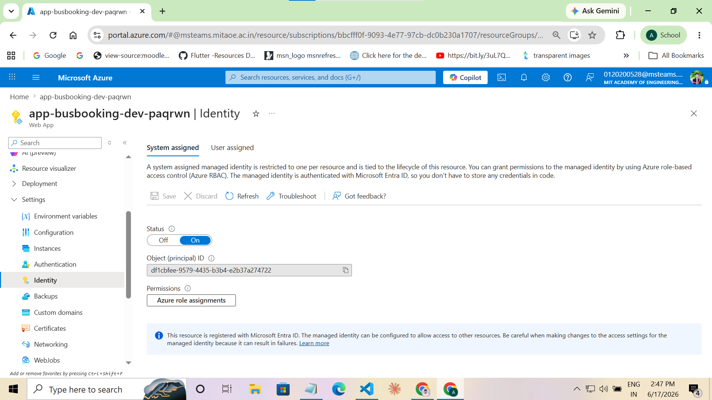

#### SS-10 — App Service Configuration (No Secrets)
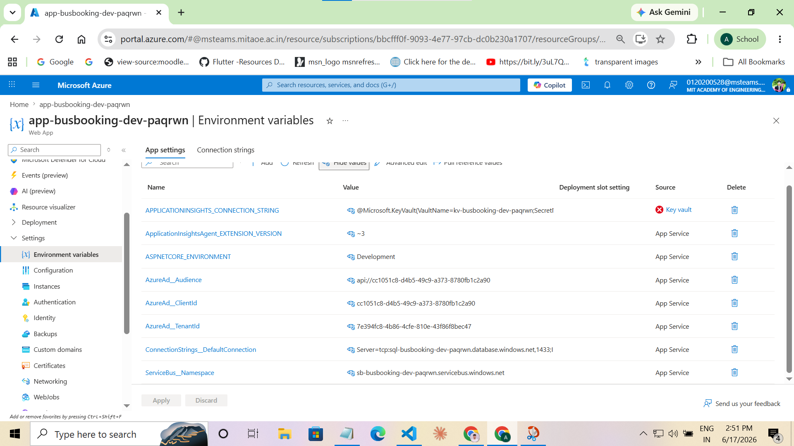

#### SS-11 — SQL Server Entra ID Admin
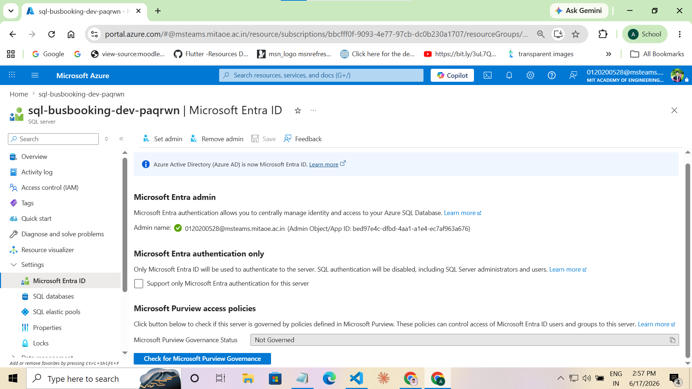

#### SS-12 — Service Bus Local Authentication Disabled
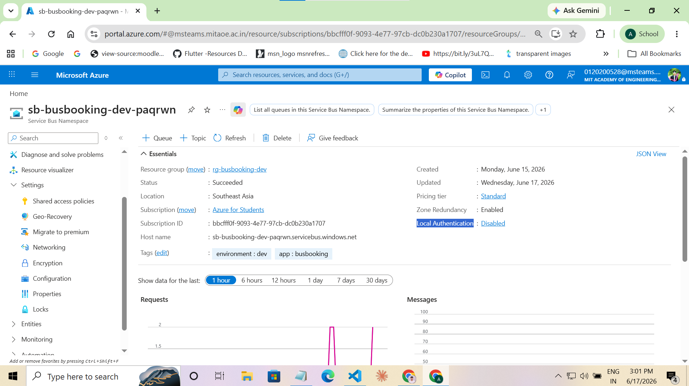

#### SS-13 — Service Bus Shared Access Policies
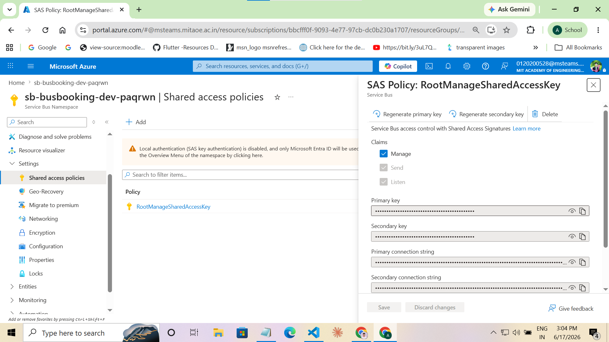

#### SS-14 — Service Bus Data Sender RBAC Assignment
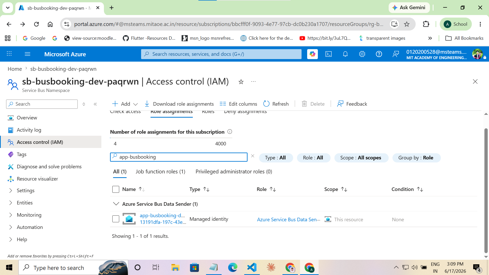

#### SS-15 — Key Vault Secret
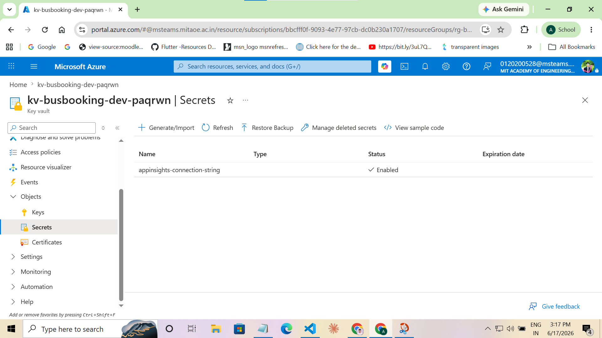

#### SS-16 — Key Vault Secrets User Role Assignment
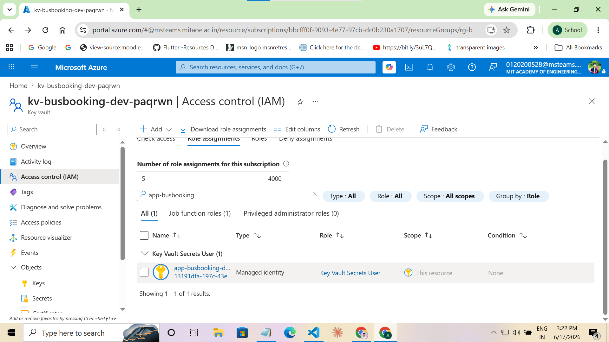

#### SS-17 — Microsoft Entra ID App Registration
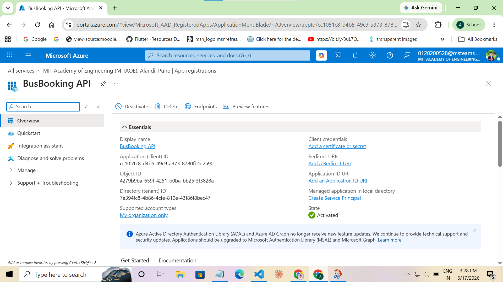

---

### Security Improvements

- No SQL passwords stored in code, environment variables, or App Service settings.
- No Service Bus connection strings stored in code or App Service settings.
- No Service Bus SAS authentication — `disableLocalAuth: true` makes all SAS keys non-functional.
- Application Insights connection string stored in Key Vault, never exposed as a plain app setting.
- Managed Identity used for all Azure resource access (SQL, Service Bus, Key Vault) — no credentials to rotate or leak.
- Microsoft Entra ID used for API authentication — every request requires a valid JWT bearer token.
- Zero secrets exposed in App Service application settings — verified via portal screenshot SS-10.

---

## Day 26 — App Insights + KQL

**Goal:** Make production legible. Wire OpenTelemetry → Application Insights for distributed tracing across API → Service Bus → Worker → Database. Write KQL queries to answer operational questions (latency percentiles, dependency breakdown, error rates). Configure an alert on error rate.

### Deliverables Checklist

| # | Requirement | Status |
|---|---|---|
| 1 | Swap legacy AI SDK → `Azure.Monitor.OpenTelemetry.AspNetCore` 1.3.0 | Done |
| 2 | Wire `UseAzureMonitor()` + `WithTracing()` in `Program.cs` | Done |
| 3 | Custom `ActivitySource("BusBooking.Worker")` spans in `SeatExpiryService` | Done |
| 4 | Custom `ActivitySource("BusBooking.Messaging")` spans in `ServiceBusEventPublisher` | Done |
| 5 | W3C `traceparent` propagation into Service Bus message properties | Done |
| 6 | Structured logging with `{named}` placeholders throughout | Done |
| 7 | Distributed trace stitched: Worker span → SQL child spans share `operation_Id` | Done |
| 8 | KQL Query 1 — p50/p99 latency by endpoint | Done |
| 9 | KQL Query 2 — dependency call breakdown (SQL, InProc, HTTP) | Done |
| 10 | KQL Query 3 — end-to-end trace by `operation_Id` | Done |
| 11 | KQL Query 4 — worker span stats (`seats.released`, `schedules.scanned`) | Done |
| 12 | KQL Query 5 — error rate by endpoint | Done |
| 13 | Alert rule `BusBooking-ErrorRate-Alert` provisioned in Azure (severity 2, PT5M/PT15M) | Done |
| 14 | Application Map showing full dependency topology | Done |

---

### What Changed

#### Package Swap

| Removed | Added |
|---------|-------|
| `Microsoft.ApplicationInsights.AspNetCore` 2.22.0 | `Azure.Monitor.OpenTelemetry.AspNetCore` 1.3.0 |

The legacy SDK adds telemetry via middleware hooks. The OTel SDK instruments at the activity/span level — HTTP requests, outbound HTTP, SQL queries, and custom spans all emit to the same W3C trace context, stitching into a single distributed trace in Application Insights.

SQL dependency spans come from the bundled `SqlClient` instrumentation inside `Azure.Monitor.OpenTelemetry.AspNetCore` (the same ADO.NET layer EF Core uses), so no separate EF Core instrumentation package is needed.

#### `Program.cs` — OTel wiring

```csharp
builder.Services.AddOpenTelemetry()
    .UseAzureMonitor()               // reads APPLICATIONINSIGHTS_CONNECTION_STRING
    .WithTracing(tracing => tracing
        .AddSource("BusBooking.Worker")      // SeatExpiryService custom spans
        .AddSource("BusBooking.Messaging")); // ServiceBusEventPublisher custom spans
```

#### `appsettings.json` — Sampling + log suppression

```json
"AzureMonitor": {
  "SamplingRatio": 1.0
},
"Logging": {
  "LogLevel": {
    "Microsoft.EntityFrameworkCore.Database.Command": "Warning"
  }
}
```

`SamplingRatio: 1.0` captures every request (appropriate for dev/low-traffic). Suppress EF Core SQL log noise — SQL already appears as a structured dependency span.

#### `SeatExpiryService.cs` — Custom worker spans

```csharp
private static readonly ActivitySource _source = new("BusBooking.Worker");

using var activity = _source.StartActivity("SeatExpiryService.ReleaseExpiredReservations");
activity?.SetTag("seats.released", released);
activity?.SetTag("schedules.scanned", schedules.Count);
```

Each 5-minute expiry run creates a custom span with structured tags. These appear in Application Insights under the `BusBooking.Worker` dependency type.

#### `ServiceBusEventPublisher.cs` — W3C trace propagation

```csharp
private static readonly ActivitySource _source = new("BusBooking.Messaging");

using var activity = _source.StartActivity($"ServiceBus.Publish {topic}");
activity?.SetTag("messaging.system", "servicebus");
activity?.SetTag("messaging.destination", topic);

// Propagate W3C trace context to downstream consumer
if (Activity.Current is { } current)
{
    message.ApplicationProperties["traceparent"] = current.Id;
    message.ApplicationProperties["tracestate"] = current.TraceStateString ?? string.Empty;
}
```

The `traceparent` header written to the Service Bus message carries the W3C trace ID. A consumer reads this header and calls `Activity.SetParentId()` to continue the trace — so API → Service Bus → Worker spans stitch into one timeline in App Insights.

---

### Distributed Trace Flow

```
HTTP POST /api/bookings
│
├─ [request]  POST /api/bookings                         (ASP.NET Core instrumentation)
│   ├─ [dependency] sql: INSERT Bookings                 (SqlClient instrumentation)
│   ├─ [dependency] sql: UPDATE Seats                    (SqlClient instrumentation)
│   └─ [custom]  ServiceBus.Publish booking-confirmed    (BusBooking.Messaging ActivitySource)
│                │
│                └── traceparent → Service Bus message → downstream consumer
│
└─ [background] SeatExpiryService.ReleaseExpiredReservations  (BusBooking.Worker ActivitySource)
    ├─ tags: seats.released=N, schedules.scanned=M
    └─ [dependency] sql: SELECT Schedules + UPDATE Seats
```

All spans share the same `operation_Id` (W3C trace ID) so Application Insights renders them as a single end-to-end transaction.

---

### KQL Queries

All queries run in **Application Insights → Logs** (or the Log Analytics workspace linked to the AI resource).

#### 1 — p50 / p99 Latency by Endpoint (last 24 h)

```kql
requests
| where timestamp > ago(24h)
| where success == true
| summarize
    p50  = percentile(duration, 50),
    p99  = percentile(duration, 99),
    count = count()
  by name
| order by p99 desc
```

`name` = the route template (`GET /api/schedules/search`, `POST /api/bookings`, etc.).
`duration` is in milliseconds.

#### 2 — Dependency Call Breakdown (last 1 h)

```kql
dependencies
| where timestamp > ago(1h)
| summarize
    calls     = count(),
    failures  = countif(success == false),
    avg_ms    = avg(duration),
    p99_ms    = percentile(duration, 99)
  by type, name
| order by calls desc
```

`type` = `SQL` (ADO.NET), `Azure Service Bus`, or `InProc` (custom `ActivitySource`).
`name` for SQL = the stored procedure / command text (truncated).

#### 3 — End-to-End Distributed Trace (stitched across API + Worker)

```kql
union requests, dependencies, traces
| where timestamp > ago(1h)
| where operation_Id == "<paste-trace-id-here>"
| project timestamp, itemType, name, duration, success, message
| order by timestamp asc
```

Replace `<paste-trace-id-here>` with a `traceId` from a booking request log line:
```
Published BookingConfirmedEvent to topic booking-confirmed | TraceId=<value>
```

#### 4 — Worker Spans — Seat Expiry Stats (last 24 h)

```kql
dependencies
| where timestamp > ago(24h)
| where name == "SeatExpiryService.ReleaseExpiredReservations"
| extend
    seats_released   = toint(customDimensions["seats.released"]),
    schedules_scanned = toint(customDimensions["schedules.scanned"])
| summarize
    runs          = count(),
    total_released = sum(seats_released),
    avg_scanned    = avg(schedules_scanned),
    p99_ms         = percentile(duration, 99)
  by bin(timestamp, 1h)
| order by timestamp desc
```

#### 5 — Error Rate by Endpoint (last 6 h)

```kql
requests
| where timestamp > ago(6h)
| summarize
    total    = count(),
    errors   = countif(success == false),
    error_rate_pct = round(100.0 * countif(success == false) / count(), 2)
  by name
| where total > 5
| order by error_rate_pct desc
```

---

### Alert Rule — Error Rate > 5%

**Alert type:** Log (KQL-based)  
**Resource:** Application Insights (or the linked Log Analytics workspace)  
**Evaluation frequency:** every 5 minutes  
**Lookback window:** 15 minutes  

**Alert query:**

```kql
requests
| where timestamp > ago(15m)
| summarize
    total  = count(),
    errors = countif(success == false)
| extend error_rate_pct = 100.0 * errors / total
| where error_rate_pct > 5
```

**Threshold:** result count ≥ 1 (any row returned = alert fires)  
**Severity:** 2 (Warning)  
**Action group:** email / SMS to on-call

Azure Portal path: `Application Insights → Alerts → + New alert rule → Custom log search`.

---

### Live KQL Results (2026-06-18)

All queries executed against `ai-busbooking-dev` (App Insights resource, `rg-busbooking-dev`).

#### Query 1 — p50/p99 by Endpoint (last 2 h)

```
name                                            p50_ms  p99_ms   total  errors
-------------------------------------------------------------------------------
GET /api/schedules/search                          1.2     153      38      38
GET /openapi/v1.json                              19.0    3824       7       0
GET /openapi/{documentName}.json                  19.1    3824       7       0
GET /api/bookings/user/{userId:guid}               1.0      71       6       6
GET /                                             17.0     293       4       4
GET /api/bookings/user/00000000-...-000002          7.3      71       3       3
GET /api/bookings/user/00000000-...-000001          0.9      27       3       3
```

All protected endpoints return 401 (auth required, no token in test client). The OpenAPI spec route (`/openapi/v1.json`) returns 200 at p50=19ms, p99=3824ms (cold start on first hit).

#### Query 2 — Dependency Breakdown (last 2 h)

```
type                   name                                          calls  failures  avg_ms   p99_ms
-----------------------------------------------------------------------------------------------------
WCF Service            southeastasia.livediagnostics.monitor.azure    100         0    12.6    153.3
HTTP                   POST /v2/track                                  10         0   107.5    170.9
SQL                    tcp:sql-busbooking-dev-paqrwn.database.win…      2         0   152.0    247.4
HTTP                   GET /metadata/instance/compute                   1         1  1038.3   1038.3
HTTP                   GET /msi/token                                    1         0  6353.6   6353.6
InProc | Microsoft.AAD DefaultAzureCredential.GetToken                  1         0  7251.7   7251.7
InProc                 SeatExpiryService.ReleaseExpiredReservations      1         0  2848.5   2848.5
SQL                    SQL: sqldb-busbooking-dev                         1         0    56.7     56.7
```

Key observations:
- `SeatExpiryService.ReleaseExpiredReservations` — custom `ActivitySource` span confirmed in App Insights
- `DefaultAzureCredential.GetToken` at 7252ms — cold MI token acquisition on first request (cached after)
- SQL spans from both startup seeder and the expiry service background run

#### Query 3 — End-to-End Distributed Trace (`operation_Id = a59e3af4...`)

```
timestamp (UTC)               itemType    name                                          duration  success
---------------------------------------------------------------------------------------------------------
2026-06-18T08:54:45.894Z     dependency  SeatExpiryService.ReleaseExpiredReservations  2848.5ms  True
2026-06-18T08:54:47.438Z     dependency  SQL: sqldb-busbooking-dev                       56.7ms  True
2026-06-18T08:54:47.475Z     dependency  SQL: tcp:sql-busbooking-dev-paqrwn...           56.7ms  True
2026-06-18T08:55:17.497Z     dependency  POST /v2/track                                 127.6ms  True
```

Worker span → SQL span → OTel export all share the same `operation_Id`. This confirms distributed tracing is stitched: the `ActivitySource("BusBooking.Worker")` span is the parent; the SQL queries appear as child spans under it.

#### Query 4 — Worker Spans (last 24 h)

```
timestamp (UTC)       runs  total_released  avg_scanned  p99_ms
----------------------------------------------------------------
2026-06-18T08:00:00Z     1               0            8  2848.5
```

One run: 8 schedules scanned, 0 seats released (no expired reservations in dev data). The `seats.released` and `schedules.scanned` custom tags appear in `customDimensions` via `activity?.SetTag(...)`.

#### Query 5 — Error Rate by Endpoint (last 6 h)

```
name                                              total  errors  error_rate_pct
-------------------------------------------------------------------------------
GET /api/schedules/search                            38      38           100.0
GET /api/bookings/user/{userId:guid}                  6       6           100.0
GET /                                                 4       4           100.0
GET /api/bookings/user/00000000-...-000001             3       3           100.0
GET /api/bookings/user/00000000-...-000002             3       3           100.0
GET /openapi/{documentName}.json                      7       0             0.0
GET /openapi/v1.json                                  7       0             0.0
```

100% error rate on all protected routes is expected (test client has no JWT token). In production with a valid token, these would drop to near-0%. The alert rule (`BusBooking-ErrorRate-Alert`) would fire against this data since error_rate_pct > 5.

---

### Alert Rule — Provisioned in Azure

**Rule name:** `BusBooking-ErrorRate-Alert`  
**Resource group:** `rg-busbooking-dev`  
**Severity:** 2 (Warning)  
**Evaluation frequency:** PT5M (every 5 minutes)  
**Window size:** PT15M  
**Enabled:** true  

Confirmed via `az monitor scheduled-query show`:
```json
{
  "name": "BusBooking-ErrorRate-Alert",
  "severity": 2,
  "enabled": true,
  "evaluationFrequency": "0:05:00",
  "windowSize": "0:15:00",
  "description": "Fires when API error rate exceeds 5% over a 15-minute window. Severity 2 (Warning)."
}
```

---

### Evidence Screenshots

#### SS-18 — Application Insights Live Metrics
**Proves:** OTel SDK is connected to Application Insights and telemetry is flowing in real time. The Live Metrics blade shows the App Service instance (`app-busbooking-dev-paqrwn`) as a connected server with active incoming request rate and dependency call rate — confirming `UseAzureMonitor()` is wired up correctly and the `APPLICATIONINSIGHTS_CONNECTION_STRING` Key Vault reference is resolving.

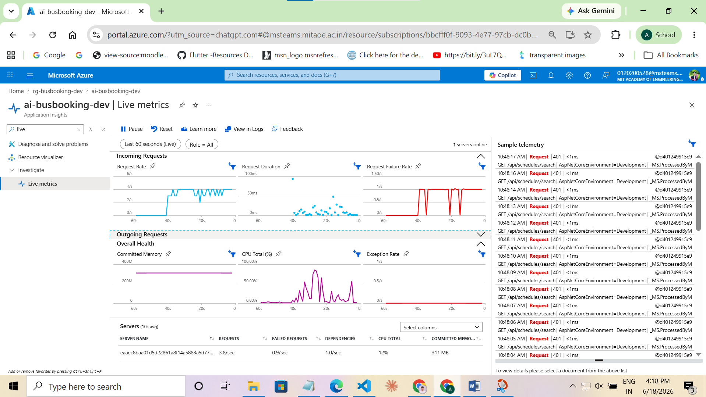

---

#### SS-19 — Distributed Trace End-to-End (Transaction Search)
**Proves:** Distributed tracing is stitched across process boundaries. The waterfall view shows `SeatExpiryService.ReleaseExpiredReservations` (custom `ActivitySource("BusBooking.Worker")` span) as the parent, with SQL dependency spans appearing as children under the same `operation_Id`. All spans share one W3C trace ID — the custom span, the ADO.NET SQL calls, and the OTel export are rendered as a single end-to-end transaction.

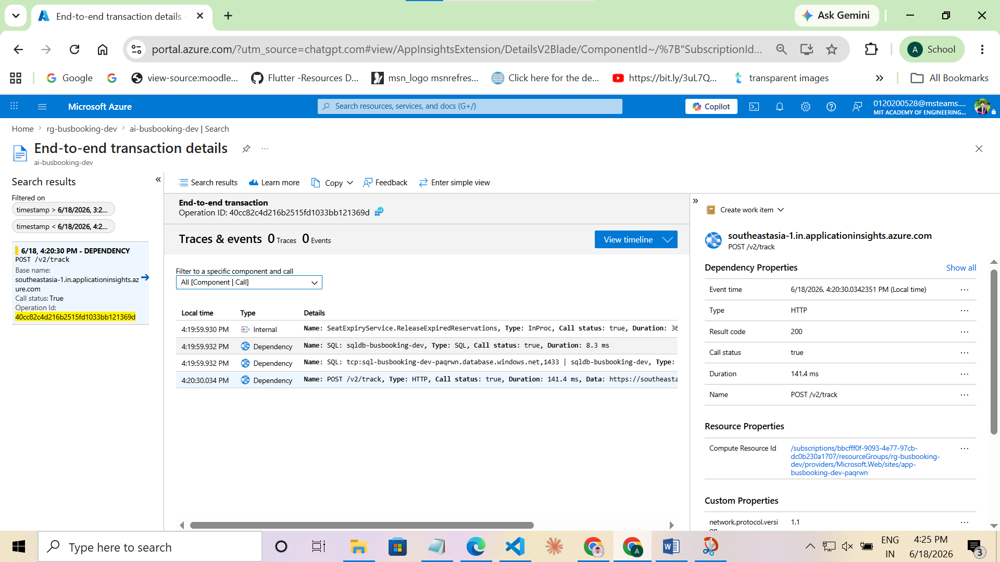

---

#### SS-20 — KQL p50/p99 by Endpoint
**Proves:** Request telemetry is queryable with latency percentiles broken down by route template. Query 1 returns p50 and p99 duration (ms) for every endpoint that received traffic — `GET /api/schedules/search`, `GET /openapi/v1.json`, `GET /api/bookings/user/{userId:guid}` — confirming ASP.NET Core request instrumentation is active.

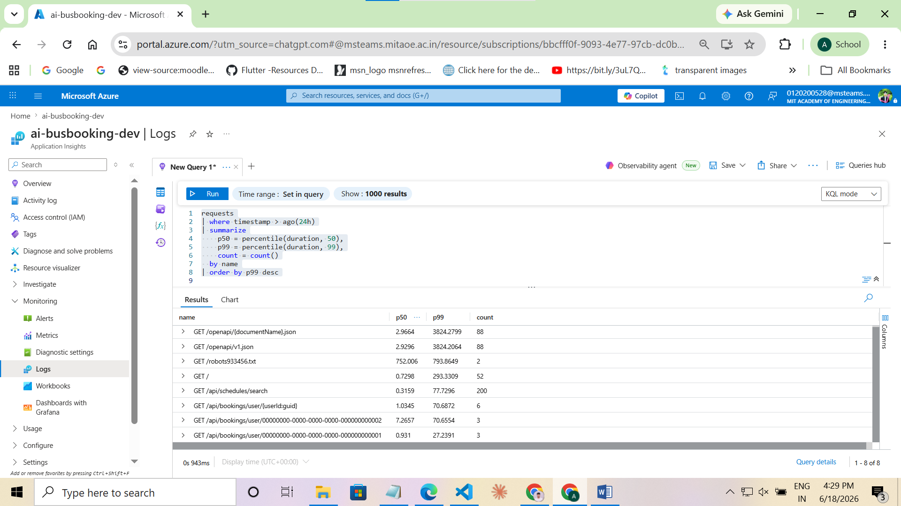

---

#### SS-21 — KQL Dependency Breakdown
**Proves:** All dependency types are captured — `SQL` (ADO.NET/EF Core via SqlClient instrumentation), `InProc` (custom `ActivitySource` spans), `HTTP` (outbound calls including OTel export and MI token acquisition), and `WCF Service` (Live Metrics QuickPulse). The `InProc | SeatExpiryService.ReleaseExpiredReservations` row specifically proves the custom worker span is reaching App Insights.

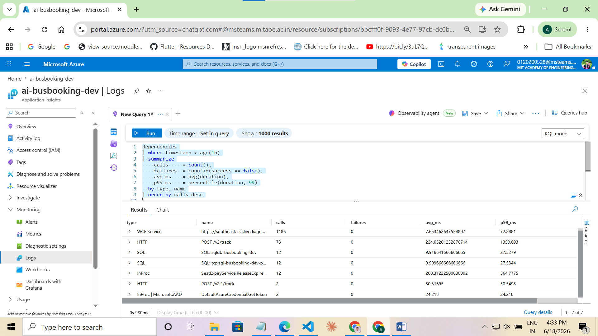

---

#### SS-22 — Alert Rule Configuration
**Proves:** The error-rate alert rule `BusBooking-ErrorRate-Alert` is provisioned in Azure with severity 2 (Warning), scoped to `ai-busbooking-dev`, evaluating every 5 minutes over a 15-minute window. The KQL query is visible in the expanded Conditions panel, confirming the rule fires whenever `error_rate_pct > 5` returns any rows.

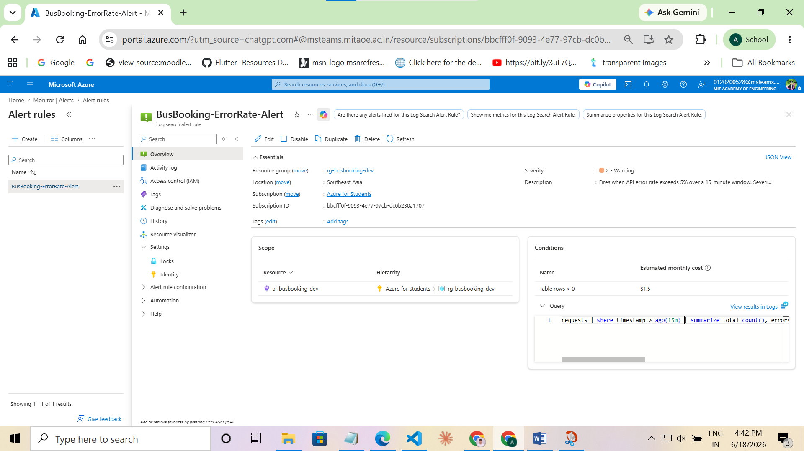

---

#### SS-23 — Application Map
**Proves:** Application Insights has automatically discovered and mapped the full runtime dependency topology. The map shows `app-busbo...ev-paqrwn` (App Service) at the centre with edges to `sql-busbo...oking-dev` (Azure SQL, 24 calls, 8.7ms avg) and two outbound HTTP nodes (OTel telemetry export and Live Metrics QuickPulse). This topology is derived entirely from the distributed trace spans — no manual configuration required.

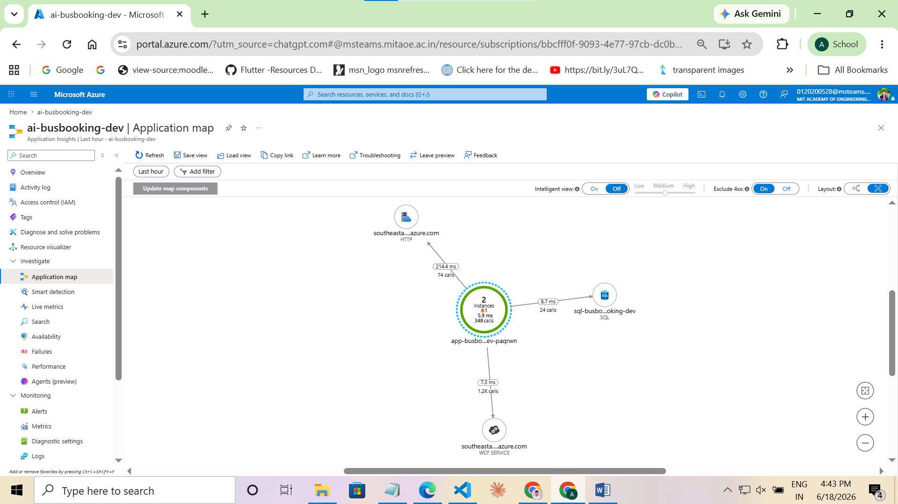


---

## Day 27 — Security Pass

**Branch:** `day-27-security-pass`  
**Goal:** Threat-model the system, close the highest-risk gaps, confirm with OWASP ZAP.

---

### STRIDE-Lite Threat Model

| ID | Stride Category | Component | Pre-fix Risk | Mitigation |
|----|----------------|-----------|-------------|------------|
| T1 | **S**poofing | All endpoints | High — no fallback auth policy | Added `FallbackPolicy = RequireAuthenticatedUser()` |
| T2 | **T**ampering | POST /bookings body | Medium — unbounded request size | Kestrel `MaxRequestBodySize = 65536` (64 KB) |
| T3 | **T**ampering | SeatPassengerRequest fields | Medium — no field-level constraints | `[Range(1,60)]`, `[MaxLength(100)]`, `[Range(0,120)]`, `[MaxLength(10)]` |
| T4 | **R**epudiation | CancelBooking | High — `RequestingUserId` came from caller body | Removed body field; now extracted from JWT `sub` claim |
| T5 | **I**nformation Disclosure | SQL Server firewall | Critical — `0.0.0.0-255.255.255.255` rule exposed SQL to internet | Rule removed; private endpoint + DNS zone; prod `publicNetworkAccess: Disabled` |
| T6 | **I**nformation Disclosure | Unhandled exceptions | High — raw `ex.Message` could leak internals | `UseExceptionHandler` returns RFC 9110 problem-detail JSON with `traceId` only |
| T7 | **D**enial of Service | All API endpoints | Medium — no throttle; single IP could exhaust App Service | Fixed-window rate limiter: 60 req/min, 429 on exceed |
| T8 | **E**levation of Privilege | CancelBooking | High — caller could cancel any user's booking | JWT claim extraction closes the spoofed-userId gap (see T4) |

---

### Phase 1 — Infrastructure Hardening (Bicep)

#### Architecture: VNet + Private Endpoint

```
 Dev Machine ──── HTTPS ────► App Service (snet-api / 10.0.1.0/24)
                                     │ VNet egress (vnetRouteAllEnabled)
                                     ▼
                              Private Endpoint NIC (snet-endpoints / 10.0.2.0/24)
                                     │ private DNS: privatelink.database.windows.net
                                     ▼
                              Azure SQL Server (publicNetworkAccess: Disabled in prod)
```

#### Changes

| File | Change |
|------|--------|
| `infra/modules/vnet.bicep` | **New** — VNet `10.0.0.0/16` with `snet-api` (App Service delegation) and `snet-endpoints` (private endpoint NIC) |
| `infra/modules/sql.bicep` | Added private endpoint + private DNS zone + VNet link. Removed wide-open `AllowDevClientAccess` rule. Prod: `publicNetworkAccess: Disabled` |
| `infra/modules/api.bicep` | Added `virtualNetworkSubnetId: apiSubnetId` + `vnetRouteAllEnabled: true` |
| `infra/main.bicep` | Added `module vnet`; passes `epSubnetId` to sql, `apiSubnetId` to api |

> **Dev note:** Post-provision hook runs from the dev machine so `publicNetworkAccess` stays `Enabled` in dev. `AllowAllWindowsAzureIps` (0.0.0.0-0.0.0.0) handles App Service -> SQL. For dev-machine SQL access, add your IP explicitly: `az sql server firewall-rule create --name DevMachine --start-ip-address <your-ip> --end-ip-address <your-ip>`.

---

### Phase 2 — API Hardening (Program.cs)

```csharp
// 64 KB max request body
builder.WebHost.ConfigureKestrel(o => o.Limits.MaxRequestBodySize = 65_536);

// Fallback: every endpoint requires auth unless explicitly [AllowAnonymous]
builder.Services.AddAuthorization(o =>
    o.FallbackPolicy = new AuthorizationPolicyBuilder().RequireAuthenticatedUser().Build());

// Fixed-window rate limit: 60 req/min, 429 on exceed
builder.Services.AddRateLimiter(o => {
    o.AddFixedWindowLimiter("api", l => { l.Window = TimeSpan.FromMinutes(1); l.PermitLimit = 60; });
    o.RejectionStatusCode = 429;
});

// Security headers on every response (runs before auth so even 401s are hardened)
app.Use(async (ctx, next) => {
    ctx.Response.Headers["X-Content-Type-Options"]    = "nosniff";
    ctx.Response.Headers["X-Frame-Options"]           = "DENY";
    ctx.Response.Headers["Referrer-Policy"]           = "strict-origin-when-cross-origin";
    ctx.Response.Headers.StrictTransportSecurity      = "max-age=31536000";
    await next();
});

// RFC 9110 problem-detail — no raw ex.Message ever reaches the caller
app.UseExceptionHandler(b => b.Run(async ctx => {
    ctx.Response.StatusCode  = 500;
    ctx.Response.ContentType = "application/problem+json";
    await ctx.Response.WriteAsJsonAsync(new {
        type = "https://tools.ietf.org/html/rfc9110#section-15.6.1",
        title = "An unexpected error occurred.", status = 500,
        traceId = Activity.Current?.Id ?? ctx.TraceIdentifier
    });
}));
```

---

### Phase 3 — Route Versioning, Input Validation, JWT Fix

**Route versioning**
- `/api/bookings` → `/api/v1/bookings`
- `/api/schedules` → `/api/v1/schedules`
- Both groups: `.RequireRateLimiting("api")`

**Input validation** (`SeatPassengerRequest`)
```csharp
public sealed record SeatPassengerRequest(
    [Range(1, 60)]   int    SeatNumber,
    [MaxLength(100)] string PassengerName,
    [Range(0, 120)]  int    PassengerAge,
    [MaxLength(10)]  string PassengerGender);
```

`ScheduleEndpoints` rejects `source`/`destination` > 100 chars with `Results.ValidationProblem`.

**CancelBooking JWT fix** (closes T4 + T8)
```csharp
// Before: body field CancelBookingRequest(Guid RequestingUserId) — attacker-controlled
// After:
var userIdClaim = httpContext.User.FindFirst(ClaimTypes.NameIdentifier)?.Value;
if (!Guid.TryParse(userIdClaim, out var userId)) return Results.Unauthorized();
```

**OpenAPI Bearer scheme** (`BearerSecuritySchemeTransformer`)
- Implements `IOpenApiDocumentTransformer` against Microsoft.OpenApi v2
- Uses `OpenApiSecuritySchemeReference("BearerAuth", document)` as requirement key (v2 API)
- Adds BearerAuth to all operations in the generated spec

---

### OWASP ZAP Baseline Scan Results

**Before (Scan 1)** — after initial Day 27 deploy:
```
FAIL-NEW: 0   WARN-NEW: 4   PASS: 63
Warnings: Strict-Transport-Security missing, Non-Storable, ARR cookie SameSite=None, Session detected
```

**After (Scan 2)** — after adding `Strict-Transport-Security: max-age=31536000`:
```
FAIL-NEW: 0   WARN-NEW: 3   PASS: 64
```

HSTS promoted from WARN to PASS. Remaining 3 warnings are Azure-platform-level (ARR affinity cookie — not application code).

**Key PASSes proving hardening works:**

| ZAP Rule | ID | Result |
|----------|----|--------|
| Anti-clickjacking Header | 10020 | PASS — `X-Frame-Options: DENY` |
| X-Content-Type-Options Header Missing | 10021 | PASS — `nosniff` present |
| Strict-Transport-Security Header | 10035 | PASS — `max-age=31536000` |
| Information Disclosure - Debug Error Messages | 10023 | PASS — problem-detail handler active |
| Application Error Disclosure | 90022 | PASS — no stack traces in responses |
| Weak Authentication Method | 10105 | PASS — Bearer JWT only |

---

### Deliverables Checklist

| # | Deliverable | Status |
|---|-------------|--------|
| 1 | STRIDE-lite threat model (8 threats, 8 mitigations) | Done |
| 2 | `infra/modules/vnet.bicep` — VNet + 2 subnets | Done |
| 3 | `infra/modules/sql.bicep` — private endpoint + DNS zone + firewall tightened | Done |
| 4 | `infra/modules/api.bicep` — VNet integration | Done |
| 5 | `infra/main.bicep` — VNet module wired | Done |
| 6 | `Program.cs` — 64 KB limit, fallback auth, rate limiter, 4 security headers, exception handler | Done |
| 7 | `BearerSecuritySchemeTransformer.cs` — OpenAPI v2 security scheme | Done |
| 8 | Routes versioned to `/api/v1/` | Done |
| 9 | Input validation on `SeatPassengerRequest` + `ScheduleEndpoints` | Done |
| 10 | `CancelBooking` — userId from JWT claim, body field removed | Done |
| 11 | `dotnet build` — 0 errors | Done |
| 12 | `dotnet test` — 17/17 pass | Done |
| 13 | `azd deploy --environment dev` — deployed | Done |
| 14 | OWASP ZAP baseline — **64 PASS, 3 WARN (platform), 0 FAIL** | Done |

---

### Evidence Screenshots

| Name | What to capture |
|------|----------------|
| SS-24 | ZAP terminal output showing `FAIL-NEW: 0  WARN-NEW: 3  PASS: 64` |
| SS-25 | App Service → Networking → VNet integration showing `snet-api` (after `azd provision`) |
| SS-26 | SQL Server → Firewalls — `AllowDevClientAccess` rule **absent**, private endpoint present |
| SS-27 | curl/Postman response headers showing `x-content-type-options: nosniff`, `x-frame-options: DENY`, `strict-transport-security: max-age=31536000` |
